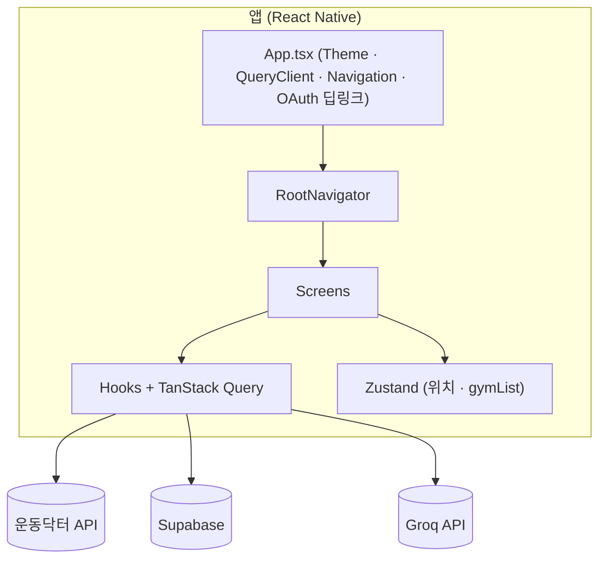
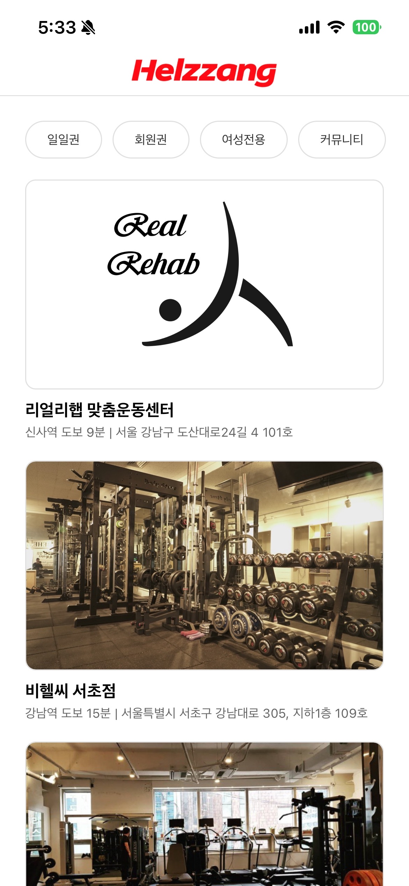
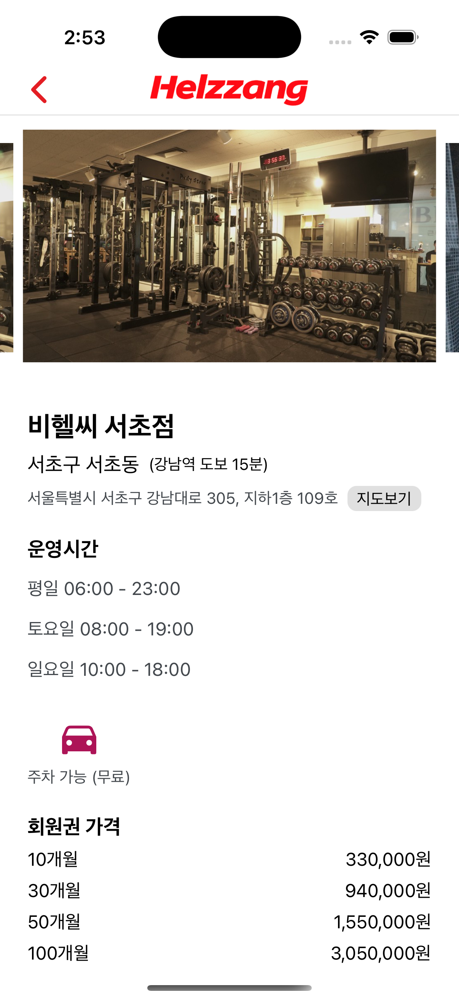
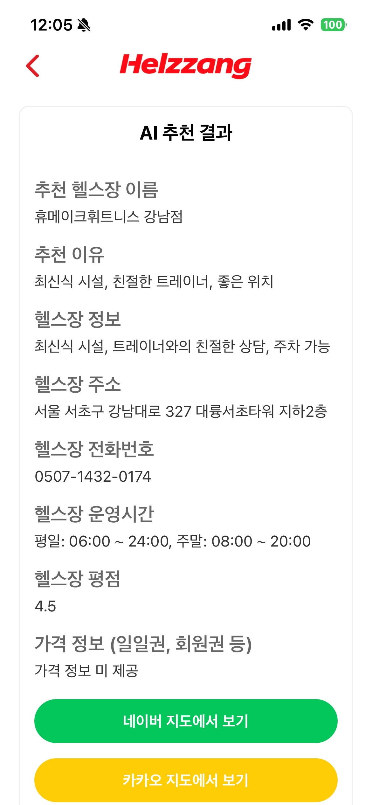
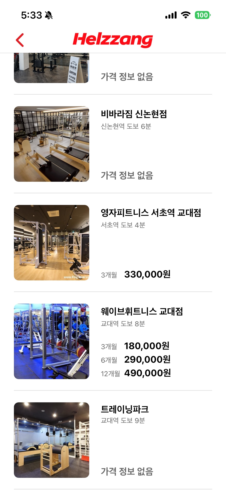
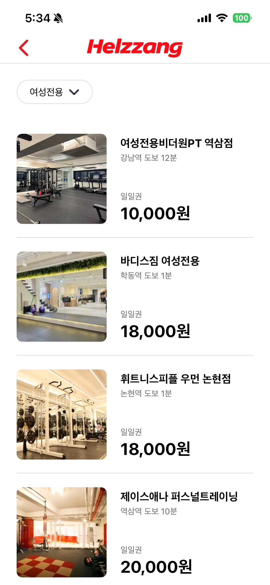
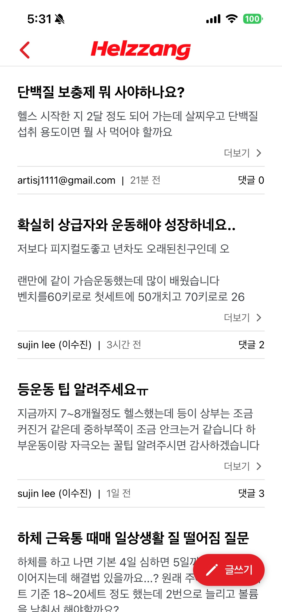
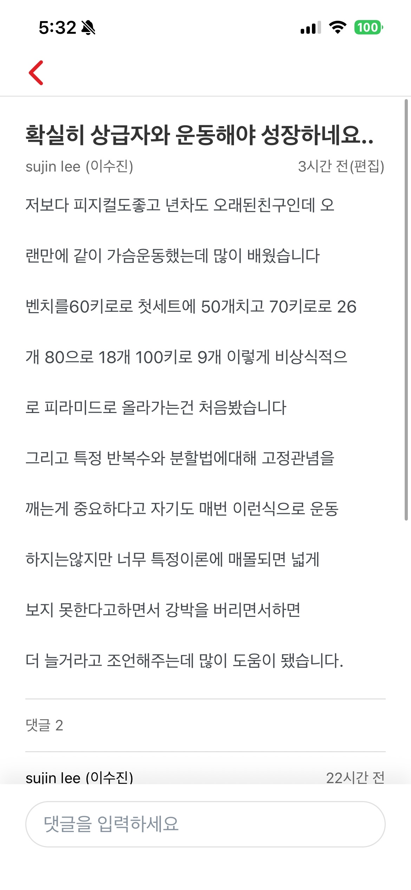
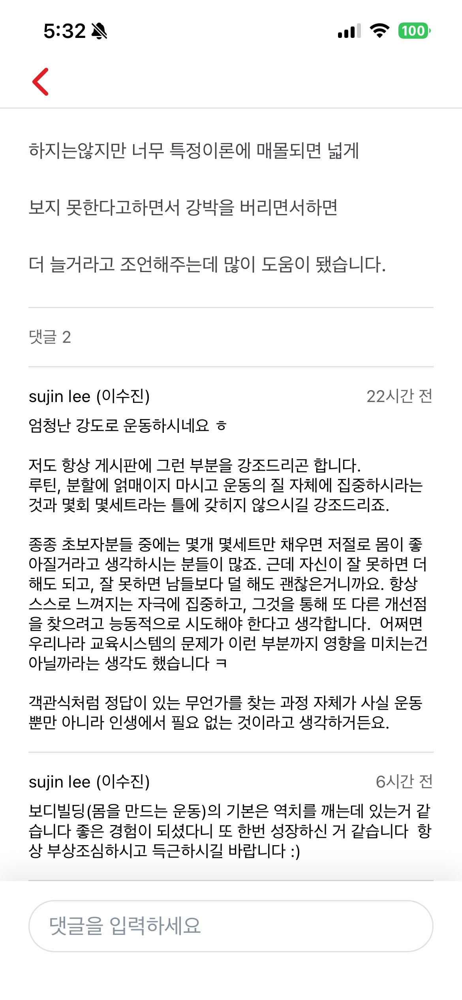
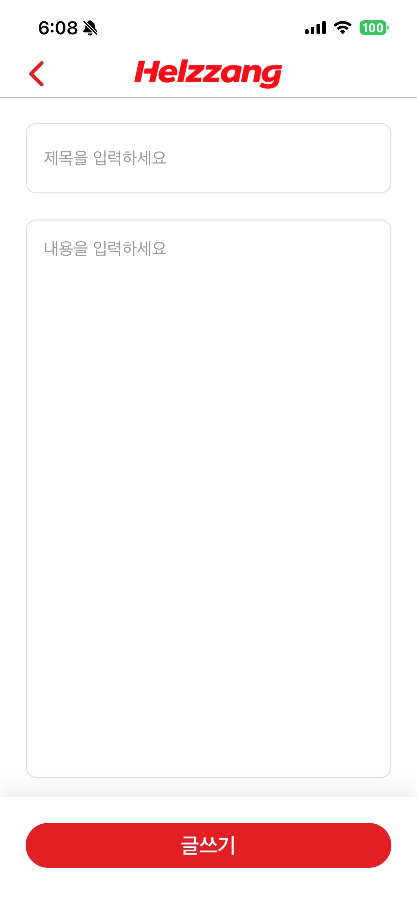

# 헬짱(helzzang)

내 주변 헬스장을 쉽고 빠르게 찾고, 헬스장 가격을 알아보고 후기 및 운동 정보를 나눌 수 있는 **헬스장 탐색 & 커뮤니티 앱**입니다.

---

## 1. 프로젝트 소개

헬짱은 다음과 같은 문제를 해결하기 위해 만들어졌습니다.

- **내 주변에 어떤 헬스장이 있는지 한눈에 보기 어렵다.**
- **헬스장 가격 정보(특히 일일권)를 모아서 보기 힘들다.**
- **운동 관련 질문이나, 주변 헬스장 후기를 믿을 만한 사람들끼리 공유하기 어렵다.**

헬짱은 아래 기능을 통해 이런 문제를 해결합니다.

- 내 현재 위치 기준으로 **주변 헬스장 목록**을 조회(운동닥터 (https://www.woondoc.com/) API 활용)
- 헬스장별 **일일권 가격 정보 노출** (운동닥터 API에 가격 데이터가 없을 경우, 합리적인 범위의 임의 가격을 표시)
- **커뮤니티 게시글 & 댓글**을 통해 운동 Q&A, 헬스장 후기 공유
- **Google 로그인 사용자만** 커뮤니티 글/댓글 작성 및 수정·삭제 가능

---

## 2. 프로젝트 구조 / 설계

### 2-1. 아키텍처 개요

| 구분         | 용도                                    |
| ------------ | --------------------------------------- |
| 운동닥터 API | 위치 기준 주변 헬스장 검색              |
| Supabase     | Google OAuth, 커뮤니티 게시글·댓글 저장 |
| Groq API     | 주변 헬스장 기반 AI 추천                |



### 2-2. 디렉터리 구조

```
helzzang/
├── App.tsx              # 진입: ThemeProvider, QueryClientProvider, NavigationContainer
├── themed.ts            # React Native Elements UI 테마·색상
├── index.js             # Metro 번들 진입점
├── assets/              # 이미지·폰트 등
├── android/ , ios/      # 네이티브 프로젝트
└── src/
    ├── navigation/      # 스택 네비게이션
    ├── screens/         # 페이지 컴포넌트
    ├── components/      # 공통 컴포넌트
    ├── hooks/           # 커스텀 훅
    ├── lib/             # Supabase 클라이언트, OAuth 콜백
    ├── store/           # Zustand 전역 스토어
    ├── types/           # API·도메인 타입
    ├── utils/           # 유틸리티 함수
    └── constants/       # 기본 위치 등 상수
```

---

## 3. 주요 기능

- **주변 헬스장 탐색**

  - `운동닥터` 앱의 API를 사용해 **주변 헬스장 목록과 기본 정보**를 가져옵니다.
  - 사용자의 현재 위치(위도/경도)를 기준으로 가까운 헬스장을 정렬해 보여줍니다.

- **헬스장 가격 정보**

  - API로 일일권 가격을 받아오면 그대로 노출합니다.

- **AI 추천 헬스장(Groq API)**

  - **Groq API**를 이용해 주변 헬스장 목록 중 **가성비가 좋은 곳**을 AI가 추천해 줍니다.
  - 추천 헬스장은 네이버 지도와 카카오 지도 딥링크를 통해 지도 앱에서 확인할 수 있습니다.
  - 무료 버전 한도가 있어, 요청이 많을 경우 응답값을 노출하지 못할 수 있습니다.

- **커뮤니티 (게시글 & 댓글)**

  - **Google 로그인한 사용자만** 게시글과 댓글을 작성할 수 있습니다.
  - 게시글/댓글 작성자는 **본인이 작성한 글만 수정·삭제**할 수 있습니다.
  - 주변 헬스장 후기, 운동 루틴, 장비 추천 등 다양한 내용을 자유롭게 공유할 수 있습니다.

- **인증 및 데이터 저장**
  - 인증 및 커뮤니티 데이터(게시글, 댓글)는 **Supabase**를 사용해 관리합니다.

---

## 4. 스크린샷

### 4-1. 헬스장 목록 화면



### 4-2. 헬스장 상세 화면



### 4-3. 내 주변 AI 추천 헬스장 화면



### 4-4. 헬스장 가격 정보 목록




### 4-5. 커뮤니티 목록 화면



### 4-6. 커뮤니티 글쓰기 & 댓글





---

## 5. 사전 요구사항

이 프로젝트를 로컬에서 실행하기 위해서는 다음 환경이 필요합니다.

- **Node.js**: `>= 20`
- **패키지 매니저**: Bun
  - macOS (Homebrew):
    ```sh
    brew install oven-sh/bun/bun
    ```
  - 공통(공식 설치 스크립트):
    ```sh
    curl -fsSL https://bun.sh/install | bash
    ```
  - 설치 후 터미널을 다시 열거나, 안내되는 대로 `PATH` 설정을 반영해 주세요.
- **React Native 개발 환경 설정**
  - Xcode & CocoaPods (iOS 빌드용, macOS 환경)
  - 자세한 내용은 React Native 공식 문서의 [환경 설정 가이드](https://reactnative.dev/docs/environment-setup)를 참고하세요.

또한 다음 외부 서비스/환경 변수가 필요합니다.

- **Supabase**
  - Google OAuth 및 커뮤니티 데이터 저장에 사용합니다.
  - 다음과 같은 환경 변수를 설정해야 합니다.
    - `SUPABASE_URL`
    - `SUPABASE_ANON_KEY`
- **Google**
  - Google OAuth 사용을 위해 다음과 같은 환경 변수를 설정해야 합니다.
    - `GOOGLE_CLIENT_SECRET`
- **Groq**
  - Groq API 사용을 위해 다음과 같은 환경 변수를 설정해야 합니다.
    - `GROQ_API_KEY`

---

## 6. 설치 및 실행 방법

### 6-1. 의존성 설치

```sh
# 패키지 설치 (bun)
bun install
```

### 6-2. 환경 변수 설정

프로젝트 루트에 `.env` 파일을 생성하고, Supabase 관련 키와 Google Client Secret 키를 설정합니다.

```env
SUPABASE_URL=...
SUPABASE_ANON_KEY=...
GOOGLE_CLIENT_SECRET=...
```

### 6-3. Metro 번들러 실행

```sh
bun start
```

### 6-4. Android 실행

```sh
bun run android
```

### 6-5. iOS 실행 (macOS)

처음 설정 시 혹은 네이티브 의존성 변경 시:

```sh
cd ios
bundle install
bundle exec pod install
cd ..
```

이후 iOS 앱 실행:

```sh
bun run ios
```

---

## 7. 사용 방법

1. **앱 실행 후 권한 허용**

   - 위치 권한을 허용하면 현재 위치를 기준으로 주변 헬스장 목록을 조회합니다.

2. **주변 헬스장 목록 확인**

   - 홈 화면과 헬스장 목록 화면에서 내 주변 헬스장 리스트를 확인할 수 있습니다.
   - 위치 권한을 허용하지 않으면 기본 위치(강남역)을 기준으로 주변 헬스장 목록을 조회합니다.

3. **Google 로그인**

   - 커뮤니티 기능을 사용하려면 Google 계정으로 로그인해야 합니다.
   - 로그인 상태는 Supabase 인증을 통해 관리됩니다.

4. **커뮤니티 글쓰기**

   - `CommunityWriteScreen`에서 운동 질문, 헬스장 후기 등을 작성할 수 있습니다.
   - 작성된 글은 커뮤니티 목록 화면에서 확인할 수 있습니다.

5. **댓글 작성 & 관리**
   - 게시글 상세 화면에서 댓글을 작성하여 질의응답을 이어갈 수 있습니다.
   - 게시글/댓글 작성자는 자신의 글만 수정하거나 삭제할 수 있습니다.

---

## 8. 자주 발생할 수 있는 문제 & 해결 방법

- **빌드/실행 시 네트워크 관련 에러**

  - `.env` 파일에 Supabase 관련 환경 변수가 제대로 설정되어 있는지 확인합니다.
  - 에뮬레이터/실기기에서 네트워크 권한이 허용되어 있는지 확인합니다.

- **커뮤니티 글/댓글 작성이 되지 않는 경우**
  - Google 로그인이 완료되었는지 확인합니다.
  - Supabase 설정(SUPABASE_URL, SUPABASE_ANON_KEY)이 올바른지 확인합니다.
